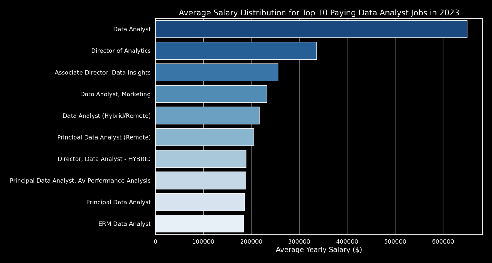

# Data Analyst Job Market Insights  

## Introduction  
Exploring the data job market! This project focuses on **data analyst roles**, uncovering **top-paying jobs**, **in-demand skills**, and the intersection of **high demand and high salary** in data analytics.  

📂 **SQL queries?** Find them here: [project_sql folder](/project_sql/).  

---  

## Background  
This project was created to **analyze key trends** in the **data analyst job market**—which roles pay the most, which skills are most in demand, and which skills contribute to the **highest earnings**. The goal is to provide **valuable insights for job seekers and professionals** looking to **strategically develop their careers**.  

The dataset comes from **Luke Barousse and Kelly Adams' SQL for Data Analytics Course** on YouTube, featuring **real-world job postings from 2023**. It includes **job titles, salaries, locations, and required skills**, offering a comprehensive view of the job market.  

📌 **Check out the SQL for Data Analytics course here:** [SQL Course](https://youtu.be/7mz73uXD9DA?si=LFIh-3Mwp0B7ZnBD)  

### Questions Answered:  
1. ❓ **Which Data Analyst roles offer the highest salaries?**  
2. ❓ **What skills are required for the top-paying Data Analyst jobs?**  
3. ❓ **What are the most in-demand skills for Data Analysts?**  
4. ❓ **What are the highest-paying skills for Data Analysts?**  
5. ❓ **What are the most optimal skills to learn for Data Analysts (high demand & high-paying)?**  

---

## Tools Used  
To extract insights from the dataset, I used:  

- **SQL** – The backbone of the analysis, enabling database queries and insights extraction.  
- **PostgreSQL** – The database system managing job postings and skills data.  
- **Visual Studio Code** – My primary SQL development environment.  
- **Git & GitHub** – Version control for organizing and sharing SQL scripts.  
- **ChatGPT** – Used for **JSON analysis and data visualization**, generating bar charts to illustrate key insights from SQL query results.  

---

## The Analysis
Each SQL query was designed to **answer a specific question** about the **data analyst job market**. Below is a breakdown of how each was approached:

---

### 1️⃣ Which Data Analyst roles offer the highest salaries?
To identify the **highest-paying roles**, I filtered **job postings** based on **annual salary** and **remote work availability**. This helped uncover where the **most lucrative opportunities** exist.

```sql
SELECT
    job_id,
    job_title,
    job_location,
    job_schedule_type,
    salary_year_avg,
    job_posted_date,
    name AS company_name
FROM 
    job_postings_fact
LEFT JOIN company_dim ON job_postings_fact.company_id = company_dim.company_id
WHERE
    job_title_short = 'Data Analyst' 
    AND job_location = 'Anywhere' 
    AND salary_year_avg IS NOT NULL
ORDER BY
    salary_year_avg DESC
LIMIT 10;
```

## Key Insights  

- **Wide Salary Range:** The top 10 highest-paying Data Analyst roles range from **$184,000 to $650,000**, highlighting strong earning potential.  
- **Diverse Employers:** High salaries are offered by a mix of companies, including **SmartAsset, Meta, AT&T, and Pinterest**, indicating demand across different industries.  
- **Job Title Variability:** Roles extend beyond **"Data Analyst"** to include **Director of Analytics, Associate Director - Data Insights, and Principal Data Analyst**, reflecting a mix of seniority levels and specializations.  

  
*Bar chart visualizing the average salaries for the top 10 highest-paying data analyst roles. ChatGPT generated this graph from my SQL query results.*

---
### 2️⃣ What Skills Are Required for the Top-Paying Data Analyst Jobs?  
To determine the **essential skills** for the **highest-paying Data Analyst roles**, I extracted the **top 10 highest-paid positions** and analyzed the associated **required skills**.  

```sql
WITH top_paying_jobs AS (
    SELECT
        job_id,
        job_title,
        salary_year_avg,
        name AS company_name
    FROM 
        job_postings_fact
    LEFT JOIN company_dim ON job_postings_fact.company_id = company_dim.company_id
    WHERE
        job_title_short = 'Data Analyst' 
        AND job_location = 'Anywhere' 
        AND salary_year_avg IS NOT NULL
    ORDER BY
        salary_year_avg DESC
    LIMIT 10
)

SELECT 
    top_paying_jobs.*,
    skills
FROM 
    top_paying_jobs
INNER JOIN skills_job_dim ON top_paying_jobs.job_id = skills_job_dim.job_id
INNER JOIN skills_dim ON skills_job_dim.skill_id = skills_dim.skill_id
ORDER BY
    salary_year_avg DESC;
```

## Key Insights

- **SQL** is the most required skill among the **top 10 highest-paying Data Analyst jobs**, appearing in multiple job postings.  
- **Python** follows closely, highlighting its importance in **data analysis, automation, and machine learning**.  
- **Tableau** is a key tool for **data visualization**, frequently appearing in **high-paying roles**.  
- Other notable skills include **R, Snowflake, Pandas, and Excel**, showing that a mix of **programming, cloud platforms, and business intelligence tools** is essential for top-tier Data Analyst roles.  
- A strong combination of **programming skills (SQL, Python, R)** and **BI tools (Tableau, Power BI, Excel)** is crucial for landing **high-paying opportunities** in data analytics.  


  
*Bar chart visualizing the frequency of required skills for the top 10 highest-paying data analyst jobs. ChatGPT generated this graph from my SQL query results.*

---

### 3️⃣ What are the most in-demand skills for Data Analysts?

To identify the **most sought-after skills**, I analyzed **job postings** to determine which skills appeared **most frequently** in job descriptions. This reveals **what employers prioritize** when hiring Data Analysts.

```sql
SELECT 
    skills,
    COUNT(skills_job_dim.job_id) AS demand_count
FROM 
    job_postings_fact
INNER JOIN skills_job_dim ON job_postings_fact.job_id = skills_job_dim.job_id
INNER JOIN skills_dim ON skills_job_dim.skill_id = skills_dim.skill_id
WHERE
    job_title_short = 'Data Analyst' 
    AND job_work_from_home = TRUE
GROUP BY
    skills
ORDER BY
    demand_count DESC
LIMIT 5;
```

## Key Insights

- **SQL** and **Excel** are the most in-demand skills for Data Analysts, emphasizing the importance of **strong foundational skills** in data manipulation and spreadsheet analysis.  
- **Python** remains a critical skill, reinforcing its role in **automation, data processing, and machine learning applications**.  
- **Data visualization tools** like **Tableau** and **Power BI** are highly sought after, indicating the growing need for **data storytelling and decision-making support**.  
- The demand for these skills reflects the **industry's shift** toward a balance between **technical programming, data processing, and visualization expertise**.  

| Skills    | Demand Count |
|-----------|-------------|
| SQL       | 7,291       |
| Excel     | 4,611       |
| Python    | 4,330       |
| Tableau   | 3,745       |
| Power BI  | 2,609       |

*Table of the demand for the top 5 skills in data analyst job postings.*

---

### 4️⃣ What are the highest-paying skills for Data Analysts?

To determine which skills lead to the highest salaries, I analyzed the average salary associated with each skill. This highlights the most financially rewarding skills for Data Analysts.

```sql
SELECT 
    skills,
    ROUND(AVG(salary_year_avg), 0) AS avg_salary
FROM 
    job_postings_fact
INNER JOIN skills_job_dim ON job_postings_fact.job_id = skills_job_dim.job_id
INNER JOIN skills_dim ON skills_job_dim.skill_id = skills_dim.skill_id
WHERE
    job_title_short = 'Data Analyst' 
    AND salary_year_avg IS NOT NULL
    AND job_work_from_home = TRUE
GROUP BY
    skills
ORDER BY
    avg_salary DESC
LIMIT 25;
```

## Key Insights

- **Big Data & Machine Learning Expertise:** High-paying Data Analyst roles prioritize skills in **big data technologies** (**PySpark, Couchbase**) and **machine learning tools** (**DataRobot, Jupyter**). The demand for **Python-based libraries** like **Pandas** highlights the industry's emphasis on data processing and predictive modeling.
- **Software Development & Automation:** Skills in **GitLab and Bitbucket** suggest a strong crossover between **data analysis and engineering**, where **automation, version control, and efficient data pipeline management** play a crucial role in commanding higher salaries.
- **Cloud & Data Engineering Specialization:** The presence of **Elasticsearch** and **Databricks** reinforces the growing reliance on **cloud-based analytics and database management**, indicating that **cloud computing proficiency** is a key driver of higher earnings.
- **Technical Versatility Matters:** The mix of **big data, machine learning, cloud computing, and development tools** reflects the industry's shift toward **a more integrated approach to data analytics, requiring both analytical and engineering capabilities**.


| Skills         | Average Salary ($) |
|---------------|-------------------|
| PySpark       | 208,172           |
| Bitbucket     | 189,155           |
| Couchbase     | 160,515           |
| Watson        | 160,515           |
| DataRobot     | 155,486           |
| GitLab        | 154,500           |
| Swift         | 153,750           |
| Jupyter       | 152,777           |
| Pandas        | 151,821           |
| Elasticsearch | 145,000           |

*Table of the average salary for the top 10 highest-paying skills for Data Analysts.*

---

### 5️⃣ What are the most optimal skills to learn for Data Analysts (high demand & high-paying)?  

To determine the **most valuable skills**, I identified skills that are both **highly demanded** in job postings and **associated with high average salaries**. This analysis highlights the **best skills** to learn for **maximizing earning potential and job opportunities**.

```sql
-- This query is written more concisely for clarity and readability.
-- If you want to see the original version with Common Table Expressions (CTEs), check the project_sql folder.

SELECT 
    skills_dim.skill_id,
    skills_dim.skills,
    COUNT(skills_job_dim.job_id) AS demand_count,
    ROUND(AVG(job_postings_fact.salary_year_avg), 0) AS avg_salary
FROM job_postings_fact
INNER JOIN skills_job_dim ON job_postings_fact.job_id = skills_job_dim.job_id
INNER JOIN skills_dim ON skills_job_dim.skill_id = skills_dim.skill_id
WHERE
    job_title_short = 'Data Analyst'
    AND salary_year_avg IS NOT NULL
    AND job_work_from_home = True 
GROUP BY
    skills_dim.skill_id
HAVING
    COUNT(skills_job_dim.job_id) > 10
ORDER BY
    avg_salary DESC,
    demand_count DESC
LIMIT 25;
```

## Key Insights

- **High-demand programming languages** like **Python** and **R** are essential for Data Analysts, with significant job opportunities. However, their widespread availability keeps their average salaries around **$101,397** for Python and **$100,499** for R.  
- **Cloud tools and big data technologies**, including **Snowflake, Azure, AWS, and BigQuery**, are in high demand and command relatively **high salaries**, reflecting the industry's shift toward **cloud-based analytics**.  
- **Business intelligence and visualization tools** such as **Tableau** and **Looker** play a critical role in **data-driven decision-making**, with strong demand and **competitive salaries** around **$99,288** and **$103,795**, respectively.  
- **Database technologies**, including **traditional relational databases (Oracle, SQL Server)** and **NoSQL solutions**, remain highly valued, with **average salaries** ranging from **$97,786** to **$104,534**, reinforcing the need for **expertise in data storage, retrieval, and management**.  

| Skill ID | Skill       | Demand Count | Average Salary ($) |
|----------|------------|--------------|--------------------|
| 8        | Go         | 27           | 115,320            |
| 234      | Confluence | 11           | 114,210            |
| 97       | Hadoop     | 22           | 113,193            |
| 80       | Snowflake  | 37           | 112,948            |
| 74       | Azure      | 34           | 111,225            |
| 77       | BigQuery   | 13           | 109,654            |
| 76       | AWS        | 32           | 108,317            |
| 4        | Java       | 17           | 106,906            |
| 194      | SSIS       | 12           | 106,683            |
| 233      | Jira       | 20           | 104,918            |
| 79       | Oracle     | 37           | 104,534            |
| 185      | Looker     | 49           | 103,795            |
| 2        | NoSQL      | 13           | 101,414            |
| 1        | Python     | 236          | 101,397            |
| 5        | R          | 148          | 100,499            |
| 78       | Redshift   | 16           | 99,936             |
| 187      | Qlik       | 13           | 99,631             |
| 182      | Tableau    | 230          | 99,288             |
| 197      | SSRS       | 14           | 99,171             |
| 92       | Spark      | 13           | 99,077             |
| 13       | C++        | 11           | 98,958             |
| 186      | SAS        | 63           | 98,902             |
| 7        | SAS        | 63           | 98,902             |
| 61       | SQL Server | 35           | 97,786             |
| 9        | JavaScript | 20           | 97,587             |

*Table displaying the optimal skills for Data Analysts based on high demand and high salaries.*

# What I Learned  

Throughout this project, I refined my **SQL expertise** and deepened my understanding of the **data analyst job market**. Here are the key takeaways from my journey:  

### 🚀 SQL Mastery  
- **Advanced Querying**: Strengthened my ability to **write complex SQL queries**, efficiently using **JOINs**, **CTEs**, and **subqueries** for **better data retrieval and analysis**.  
- **Data Aggregation**: Improved my proficiency with **GROUP BY, COUNT(), AVG()**, and other **aggregate functions** to extract meaningful insights from job postings.  
- **Optimization & Efficiency**: Learned to write **optimized queries**, reducing redundancy and making **data analysis faster and more efficient**.  

## Conclusions  

### 🔍 Key Insights  
From the analysis, several important insights emerged:  

- **Top-Paying Data Analyst Jobs**: Salaries for remote data analyst roles vary widely, with top salaries reaching **$650,000**, emphasizing the **high earning potential** in the field.  
- **Skills for High-Paying Roles**: **SQL remains essential**, appearing in most top-paying job postings, reinforcing its **importance for career advancement**.  
- **Most In-Demand Skills**: **SQL, Excel, Python, Tableau, and Power BI** are the **most sought-after** skills, highlighting the balance between **technical expertise and data visualization**.  
- **Skills with the Highest Salaries**: Niche skills like **PySpark, Couchbase, and DataRobot** are associated with the **highest salaries**, showcasing the value of **specialized expertise**.  
- **Optimal Skills to Learn**: A combination of **programming (Python, R, SQL), cloud tools (AWS, Azure, Snowflake), and business intelligence (Tableau, Looker)** offers **both high demand and competitive salaries**, making them strategic learning priorities.  

## Final Thoughts  

This project **expanded my SQL skills** and provided a **data-driven perspective** on the **data analyst job market**. By analyzing real-world job postings, I gained valuable insights into **which skills drive salaries and demand**, helping me (and others) better navigate career decisions.  

Focusing on **in-demand and high-paying skills** can significantly impact job prospects, making it crucial to **stay updated with industry trends** and continuously **refine technical skills**.  

This project reinforced the importance of **SQL, data analysis, and career-focused learning**, equipping me with **actionable insights** for making informed career decisions in the **ever-evolving field of data analytics**.  
